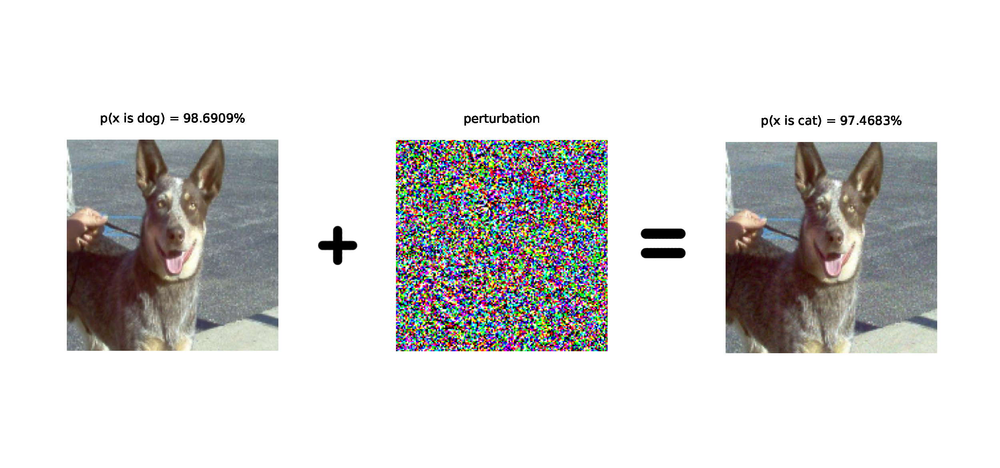
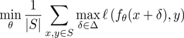
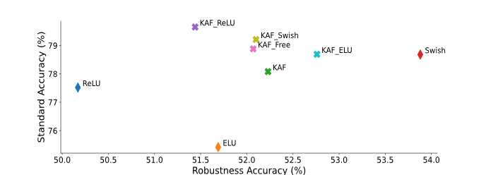

# Robustness of deep neural networks with KAFs trainable activation functions
### *Can activation functions play a role in making neural networks more robust?*

---

This repository contains code and (adversarially) trained models to reproduce results covered in ``./thesis/thesis.pdf``, my final project for the master course in Computer Science @ Sapienza University of Rome

## Context

Artificial deep neural networks (DNNs) are Machine Learning models that, despite their success, are nowadays also known to be
vulnerable to specifically-crafted perturbations of the input happening at inference time.
Such perturbations, called adversarial examples, are not easily detected by a
machine and they cause a disagreement between the model’s output and a human
consensus.

## Defenses

To prevent against adversarial examples, several approaches have been proposed ranging from Detection methods [H. Metzen et al. 2017], Provable Robustness [Jeremy M Cohen et al. 2019] and Adversarial Training [Aleksander Madry, Aleksandar Makelov et al. 2017]. We focused on this last method which consists in training a neural network to approximate the following min, max:

Where \delta is the perturbation characterized to be small, and the remaining comes from the standard notation for empirical risk minimization.

## Related Work

In [Cihang Xie, Mingxing Tan et al. 2020] ([repo](https://github.com/cihangxie/SmoothAdversarialTraining)), authors showed that it is possible to strengthen adversarial training by means of activation functions that are smooth or, in other words, functions whose first derivative is continuous everywhere. Indeed, their experiments consistently reported
greater performances when, instead of the typical rectified linear unit (ReLU), the model’s non-linearities were substituted by a smooth counterparts, such as: ELU,
GELU or Swish functions. It is worth to note that such improvement comes for "free", in the sense that no data augmentation or network growth were carried out, in contradiction with the common wisdom.

## Our Proposal

We conjecture that adversarial training can benefit from the presence, in the network’s architecutre, of kernel-based
activation functions (KAFs) [S. Scardapane et al. 2017], a class of *trainable* activation functions which
already proved to improve the performances of neural networks in a variety of
tasks. By means of properties such as *flexibility* and *smoothness*, KAFs allow for a
better computation of gradient updates during adversarial training resulting in a
general improvement of the accuracy/robustness trade-off. Moreover, KAFs only
introduce a linear number of parameters in the network, without changing the
overall structure or requiring an increased number of training samples.

## Evaluation

Empirical evaluations are performed over different adversarially trained DNNs and full strength
projected-gradient descent (PGD) attacks. We find that the employment of KAFs always
results in top accuracies and an improvement in the robustness wrt to ReLU baseline. Nevertheless, we also find that the smooth, fixed
Swish activation function consistently outperforms KAFs in terms of robustness.

We used CIFAR10 as for the dataset, one VGG inspired convolutional neural network and a ResNet20. We evaluate several versions of these architectures changing only the activation functions employed.

### ResNet20 CASE

**Fig:** *Fixed activation functions are shown with a thin diamond whereas
non-parametric KAFs with a filled x. Swish achieves best robustness and KAFs generally
tend to improve both robustness and accuracy with respect to a ReLU baseline.*

## Code

The framework used is *TensorFlow 2*, the implementation of a KAF layer is given in ``src/activationsf.py``. To solve the min max robust optimization we implemented from scratch the *fast* adversarial training proposed in [Eric Wong, Leslie Rice et al. 2020] which can be found in ``src/fbfadvtrain.py``. The step-by-step adv. training of the tested models is extensively documented in the relative notebooks ``src/fbf_training_kaf[nameofthemodel]``. Lastly the PGD attack and the evaluation is computed using the *IBM Adversarial-Robustness-Toolbox* and can be found in ``robustness_eval.py``.

